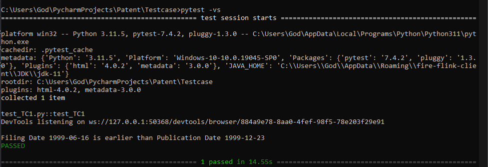

# Patent
  Patent is a simple python script to check whether the filing date is greater/earlier than the publication date of a patent.

# Requirements
  - Python 3.11
  - Code Editor (PyCharm)
  - Chrome Browser

# Instructions
  1. Create a Project "Patent" in the code editor (PyCharm).
  2. Install the latest versions of Selenium and Pytest in the Project.
  3. Download the files from the repository and paste it inside the "Patent" project.
  4. Copy the absolute path of Testcase folder.
  5. Open the Command Prompt and change the directory to the Testcase.
  6. Command `pytest -vs`

# Output

